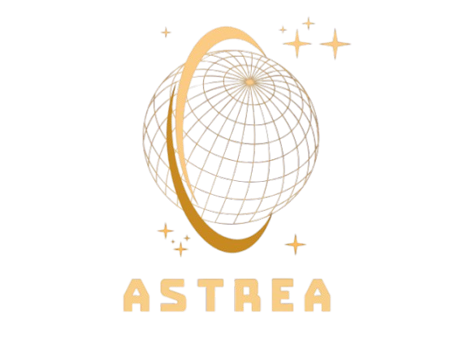

<!-- markdownlint-disable MD041 -->
<!-- markdownlint-disable-next-line MD033 -->

# Astrea
 
**A Modern C++ Astrodynamics Library**

Astrea is a high-performance, type-safe astrodynamics library designed for mission design, analysis, and aerospace applications. Built with modern C++23 features, Astrea provides a strongly-typed foundation with compile-time unit checking and coordinate frame safety, enabling developers to build robust and efficient astrodynamics software.

## Overview

The library features a comprehensive type system that prevents common errors in astrodynamics calculations through compile-time checks. With extensive algorithms for orbit propagation, coordinate transformations, and mission analysis, Astrea serves as both a complete toolkit for aerospace engineers and an extensible platform for custom applications.

## Contributing

We welcome contributions from the aerospace and software development communities. Please see our [contributing guidelines](getting_started/contributing.md) for information on how to get involved.

## Key Features

### Type Safety & Units
- **Strongly-typed units** using mp-units with compile-time dimensional analysis
- **Custom unit support** with seamless unit conversions and extensions
- **Coordinate frame safety** preventing common transformation errors
- **Compile-time unit checking** eliminating runtime unit conversion errors

### Astrodynamics Core
- **Multiple orbital element sets**: Cartesian, Keplerian, and Modified Equinoctial
- **Automatic element set conversions** with strongly-typed interfaces
- **Advanced propagation algorithms** supporting numerical and analytical methods
- **Custom force models** with extensible equations of motion framework
- **Event detection** for user-defined conditions during propagation

### Coordinate Systems & Time
- **Comprehensive frame transformations** with automatic coordinate conversions
- **Extensible frame definitions** supporting user-defined coordinate systems
- **Advanced time systems** including Julian Date, UTC, TT, and astronomical time scales
- **Dynamic frame support** for time-varying coordinate systems

### Mission Analysis
- **Access analysis** with revisit calculations and link budget modeling
- **Spacecraft modeling** with vehicles, platforms, and payload definitions
- **Thrust modeling** supporting both impulsive and continuous maneuvers
- **Celestial body definitions** with accurate gravitational parameters

### External Integration
- **SPICE integration** with fast ephemeris access using compiled Chebyshev polynomials
- **Space-Track data clients** for automated orbital data retrieval
- **NASA validation** using published 6DoF test datasets
- **Mathematical utilities** optimized for dimensional analysis

## Installation

Astrea requires C++23 and uses CMake for building. Detailed installation instructions are available in our [Getting Started Guide](getting_started/installation_and_usage.md).

## Documentation

- **[Getting Started](getting_started/)** - Installation and basic usage
- **[Examples](examples/)** - Comprehensive code examples
- **[API Reference](api/)** - Detailed API documentation
- **[Design Documentation](design/)** - Architecture and design principles

## Roadmap

### Near Term
- **Enhanced Installation**: CMake packaging and cross-platform deployment
- **Performance Benchmarks**: Google Benchmark integration with speed guarantees
- **Extended Element Sets**: Additional orbital representations and optimized transformations
- **Validation**: Real-world comparisons using GPS and tracking data

### Future Development
- **6-DoF Simulation**: Complete attitude dynamics with control system modeling
- **Advanced Propagators**: SGP4/SGP8 and specialized cislunar dynamics (CR3BP, BC4BP)
- **Mission Planning**: Trajectory optimization and automated scheduling tools
- **Environmental Models**: High-fidelity atmospheric and gravitational field models
- **Visualization**: GUI interface for analysis and mission visualization

## License

Astrea is licensed under the [GNU Lesser General Public License v3.0](LICENSE.LESSER), enabling both open-source and commercial use.
