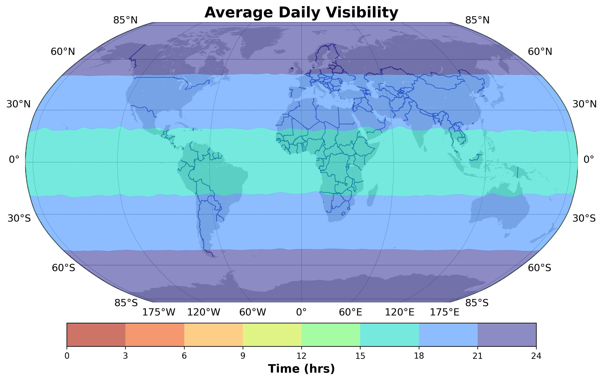
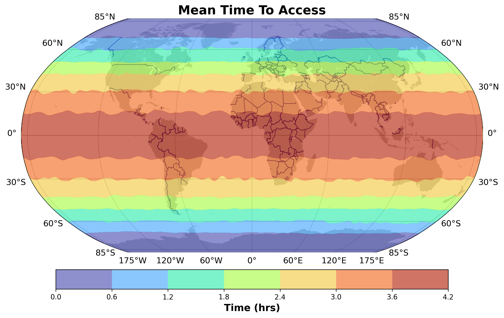
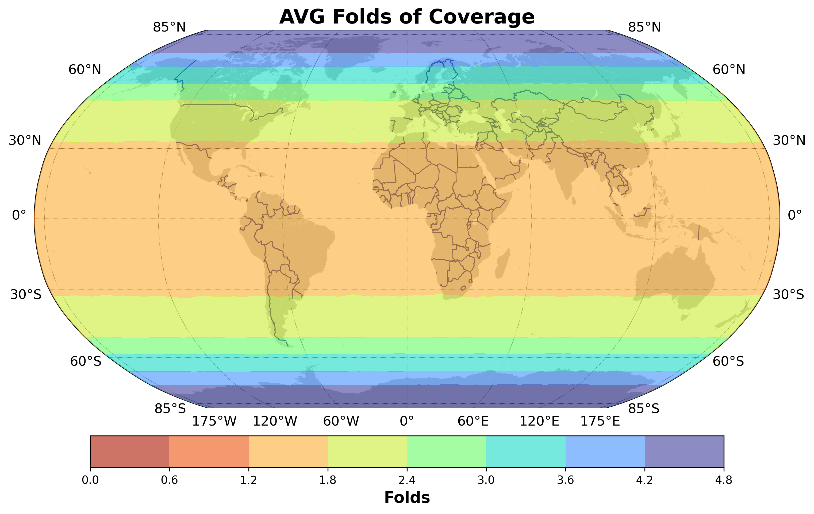

<!-- markdownlint-disable MD041 -->
<!-- markdownlint-disable-next-line MD033 -->


[](./LICENSE.LESSER)
[](https://en.cppreference.com/w/cpp/compiler_support#cpp23)

[](https://github.com/iulianojay/astrea/actions/workflows/build-and-test.yml)


# Astrea
 
**A Modern C++ Astrodynamics Library**

Astrea is a high-performance, type-safe astrodynamics library designed for mission design, analysis, and aerospace applications. Built with modern C++23 features, Astrea provides a strongly-typed foundation with compile-time unit checking and coordinate frame safety, enabling developers to build robust and efficient astrodynamics software.

## Overview

This library features a comprehensive type system that prevents common errors in astrodynamics calculations through compile-time checks - namely a strongly typed units system developed on top of mp-units, strongly typed orbital elements with in-place conversions and type-erased containers, and a system of strongly-typed framed. All of these features offer a high level of performance and safety, while also providing a flexible and extensible architecture for custom applications.

## Key Features

Many of the core features of Astrea were built based on experience in the aerospace industry, and many of the major pitfalls that astrodynamics libraries have historically had. The largest and perhaps most important is the issues of unit safety. Hidden unit conversions, implicit transitions between coordinate frames, and the general complexity of astrodynamics calculations can lead to small errors that have catastrophic consequences. By forcing developers to explicitly handle units and frames, Astrea eliminates a large class of these errors and provides a much safer development experience.

Beyond the core principles of safety, performance was a necessary benchmark for Astrea. Optimization is common in most of aerospace and as such, every second can be important. Custom integration, compiled ephemeris files, and fully constexpr system representations are just some of the ways that this library has been optimized for performance. In future releases, Astrea will be built with a set of benchmarks to allow users to test and profile the code on their own systems.

### Type Safety & Units

- **Strongly-typed units** using mp-units with compile-time dimensional analysis
```cpp
  const double timeSeconds = 3600.0;   // unsafe, implicit units, and error-prone
  const quantity<s> time = 3600.0 * s; // safe, explicit, and checked at compile-time
```
- **Custom unit support** with seamless unit conversions and extensions
```cpp
  Date now = Date::now();                         // Custom Julian Date clocks from std::chrono
  Date oneHourAgo = date - std::chrono::hours(1); // Implicit conversion from std::chrono to mp-units time
  Time oneHour = now - oneHourAgo;                // Dates, times, and chrono durations all interoperate 
  std::cout << oneHour.in(s);                     // "3600 s"
```
- **Strongly-typed frames** preventing common transformation errors
```cpp
  std::array<double> positionEci;                          // implicit units, and implicit frame
  CartesianVector<Distance, frames::earth::icrf> position; // explicit, and safe
```

### Astrodynamics Core
- **Multiple orbital element sets**: Cartesian, Keplerian, and Modified Equinoctial
```cpp
  // Cartesian elements
  Cartesian<frames::earth::icrf> cartesian{
    {7000.0 * km, 0.0 * km, 0.0 * km},            // position
    {0.0 * (km/s), 7.546 * (km/s), 0.0 * (km/s)}  // velocity
  };
  // Keplerian elements  
  Keplerian kepler{
    7000.0 * km,  // semimajoraxis
    0.01,         // eccentricity
    98.0 * deg,   // inclination
    0.0 * deg,    // raan
    0.0 * deg,    // arg of perigee
    0.0 * deg     // true anomaly
  };
```
- **Automatic element set conversions** with strongly-typed interfaces
```cpp
  AstrodynamicsSystem sys;

  // Either directly through constructors
  Keplerian kepler{/* ... */};
  Cartesian cartesian(kepler, sys.get_mu());
  Equinoctial equinoctial(cartesian, sys.get_mu());

  // Through a generic container for any element set
  OrbitalElements elements(kepler);
  Cartesian cartesian2 = elements.in_element_set<Cartesian>(sys);
  Equinoctial equinoctial2 = elements.in_element_set<Equinoctial>(sys);

  // Or using the more powerful State container
  State state(Date::now(), elements, sys);
  Cartesian cartesian3 = state.in_element_set<Cartesian>(); // explicit extraction
  Equinoctial equinoctial3 = state.in_element_set<Equinoctial>();

  state.convert_to_set<Cartesian>(); // in-place conversion of state elements
  state.convert_to_set<Equinoctial>(); 
```
- **Advanced propagation algorithms** supporting numerical and analytical methods
```cpp
  ForceModel forces;
  forces.add<AtmosphericForce>();
  forces.add<OblatenessForce>(sys, 100, 100);

  TwoBody twoBodyEom;                          // No forces
  J2MeanVop j2MeanEom;                         // Forces assumed
  CowellsMethod cowellsEom(forces);            // Regular force model
  KeplerianVop keplerianEom(forces, false);    // Input options for rounding errors
  EquinoctialVop equinoctialEom(forces, true); // Input options for singularities
```
- **Custom force models** with extensible equations of motion framework
```cpp
  ForceModel forces;
  forces.add<AtmosphericForce>();       // Add pre-defined forces
  forces.add<SolarRadiationPressure>();
  forces.add<MyCustomForce>(...);       // Or build a custom force model
```
- **Event detection** for user-defined conditions during propagation
```cpp
  Event burnEvent(ImpulsiveBurnAtPerigee()); 
  Event crossingEvent(CrashAtMinAltitude()); 
  // ... //
  integrator.propagate(state0, propTime, eoms, vehicle, store, { 
    burnEvent, 
    crossingEvent, 
    // ... //
  });
```

### Coordinate Systems & Time
- **Common frame transformations** with automatic coordinate conversions
```cpp
  // Position in ICRF frame
  RadiusVector<frames::earth::icrf> posIcrf{7000.0 * km, 0.0 * km, 0.0 * km};
  
  // Automatic transformation to J2000
  RadiusVector<frames::earth::j2000> posJ2000 = posIcrf.in_frame<frames::earth::j2000>(epoch);
  
  // Chain transformations coming soon!
  // auto posMarsIcrf = transform_to<frames::mars::icrf>(posIcrf, epoch);
```
- **Dynamic frame support** for time-varying coordinate systems
```cpp
  CartesianVector<Distance, frames::dynamic::ric> pos{7000.0 * km, 0.0 * km, 0.0 * km};
  frames::dynamic::ric ricFrame = frames::dynamic::ric::instantaneous{state}; // RIC frame defined by current state
  CartesianVector<Distance, frames::earth::icrf> posIcrf = ricFrame.rotate_out_of_this_frame<frames::earth::icrf>(pos, epoch);
```
- **Extensible frame definitions** supporting user-defined coordinate systems
```cpp
  namespace custom_frames {
    // Define spacecraft body frame
    struct SpacecraftBody : public Frame<SpacecraftBody> {
      // ...
      // ooh boy this is sure something right now but you can do it
      // ...
    };
  }
  
  CartesianVector<Thrust, custom_frames::SpacecraftBody> thrust_vector{1.0 * N, 0.0 * N, 0.0 * N};
```
- **Advanced time systems** including Julian Date, UTC, TAI, and other common time standards
```cpp
  Date now = Date::now();   // Current time in Julian Date
  Date utc = now.utc();     // Convert to UTC
  Date tai = now.tai();     // Convert to International Atomic Time
  JulianDate jd = now.jd(); // Get Julian Date
```

### Mission Analysis
- **Access analysis** with revisit calculations and link budget modeling
```cpp
  // Setup
  const Time accessResolution = minutes(5.0);
  const Date startDate = Date::now();
  const Date endDate = startDate + months(3.0);
  AstrodynamicsSystem sys;

  // Build a walker ball
  const Distance semimajor = 7000.0 * km;
  const Angle inclination = 98.0 * deg;
  const std::size_t T = 30;
  const std::size_t P = 6;
  const double F = 1.0;
  Constellation<Viewer> constelaltion(sys, startDate, semimajor, inclination, T, P F);

  // Ground station definition
  GroundStation station{"Denver", 39.7392 * deg, -104.9903 * deg, 1655.0 * m};
  
  // Access analysis
  AccessAnalyzer analyzer(accessResolution, startDate, endDate, sys, true);
  auto accesses = analyzer.find_accesses(constellation, { station }, true);
  
  // Revisit statistics
  const AccessStats stats(accesses); 
```
- **Spacecraft modeling** with vehicles, platforms, and payload definitions
```cpp
  class MySpacecraft : public Vehicle {
    // Custom spacecraft definition with mass properties, geometry, and subsystems
  };
  integrator.propagate(state0, propTime, { MySpacecraft() });
```
- **Celestial body definitions** with customizable parameters
```cpp
  // Predefined celestial bodies
  auto earth = Earth();
  auto moon = Moon();
  auto mars = Mars();
  
  // Custom body definition
  CelestialBody asteroid{
    .name = "Bennu",
    .gravitational_parameter = 5.2 * (m*m*m / (s*s)),
    .radius = 245.0 * m,
    .rotation_period = 4.297 * h
  };
```

### External Integration
- **SPICE(ish) integration** with fast ephemeris access using compiled Chebyshev polynomials
- **Space-Track data clients** for automated orbital data retrieval
- **NASA validation** using published 6DoF test datasets
- **Mathematical utilities** optimized for dimensional analysis

### Recent Additions
- **Event Detection and Scheduling**: User-defined events during propagation with callback support
- **Automatic Frame Translations**: Time-varying coordinate systems with automatic transformations
- **Custom Step Watchers**: User-defined callbacks for monitoring and modifying propagation steps
- **Improved Installation**: CMake packaging and cross-platform deployment
- **6-DoF Simulation**: Complete attitude dynamics with control system modeling
- **Performance Benchmarks**: Google Benchmark integration with speed guarantees

## Installation

Astrea requires C++23 and uses CMake for building. Detailed installation instructions are available in our [Getting Started Guide](https://iulianojay.github.io/astrea/getting_started/installation_and_usage/).

## Documentation

Documentation is available online at <https://iulianojay.github.io/astrea/>, but is still a work in progress. Please be patient as we continue to expand and improve the documentation, and feel free to contribute improvements or ask questions in the GitHub repository.

- **[Getting Started](https://iulianojay.github.io/astrea/getting_started/)** - Installation and basic usage
- **[Examples](https://iulianojay.github.io/astrea/examples/)** - Code examples
- **[API Reference](https://iulianojay.github.io/astrea/astro/links/)** - Detailed API documentation
- **[Design Documentation](https://iulianojay.github.io/astrea/design/)** - Architecture and design principles

## Roadmap

- **Environmental Models**: High-fidelity atmospheric and solar models
- **Advanced Propagators**: SGP4/SGP8 and specialized cislunar dynamics (CR3BP, BC4BP)
- **Mission Planning**: Trajectory optimization and automated scheduling tools
- **Extended Element Sets**: Additional orbital representations and optimized transformations
- **Validation**: Real-world comparisons using GPS and tracking data
- **Visualization**: GUI interface for analysis and mission visualization

## Contributing

Astrea is currently developed and maintained largely by a single developer, so help is welcomed. Please see the [contributing guidelines](getting_started/contributing.md) for information on how to get involved.

## License

Astrea is licensed under the [GNU Lesser General Public License v3.0](LICENSE.LESSER), enabling both open-source and commercial use. It is safe for use in proprietary software and projects in general.
Direct modifications, derivatives, forks, or extensions of the library must be released under the same license, but applications that link against Astrea can be licensed independently.

## Example Outputs Built with Astrea
In order to demonstrate and expand the core libraries in Astrea, a simple revisit analysis tool was added to the code. This tool, Trace, uses the foundational Astrea libraries, builds on-top of them, and provides a good set of examples on how one might safely expand and make use of the library in larger projects. Some of the features will be ingested into the core astrodynamics sub-library, but for now, their separation is used as both a practical testing ground and a demonstration of real-world practical applications.

<center>
  
  
  
</center>

These images are some of the outputs from a simple example run of Trace. Further capabilities, expanded examples, and more detailed documentation on how to use Trace will be added in the future. 