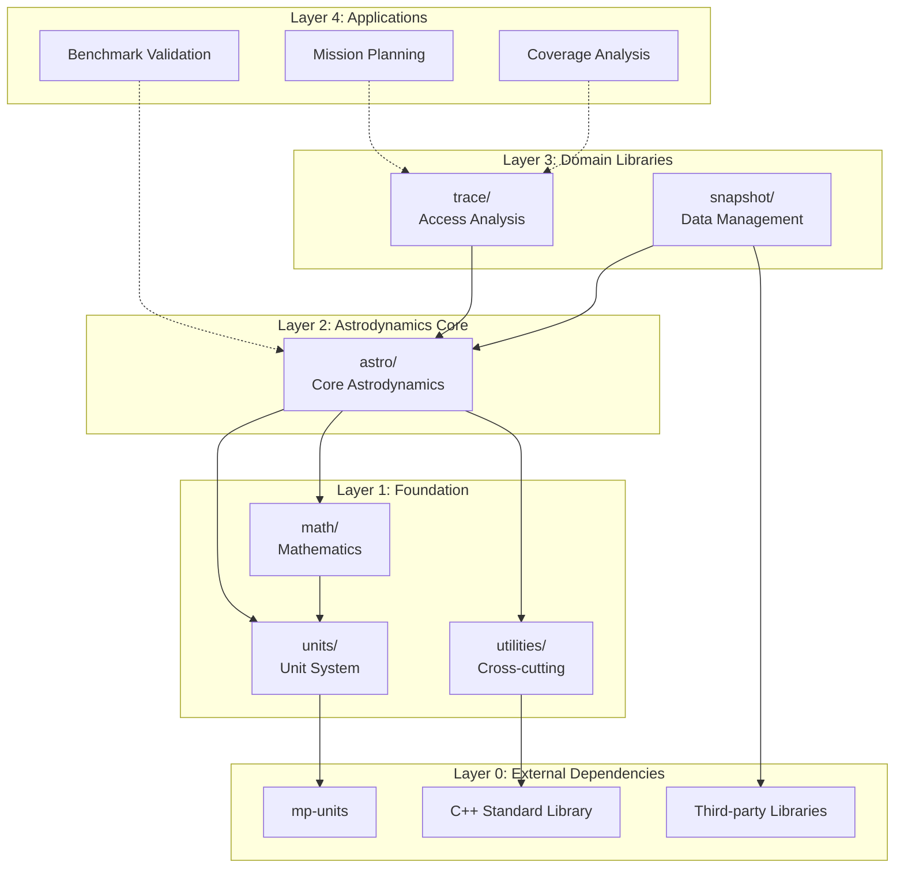
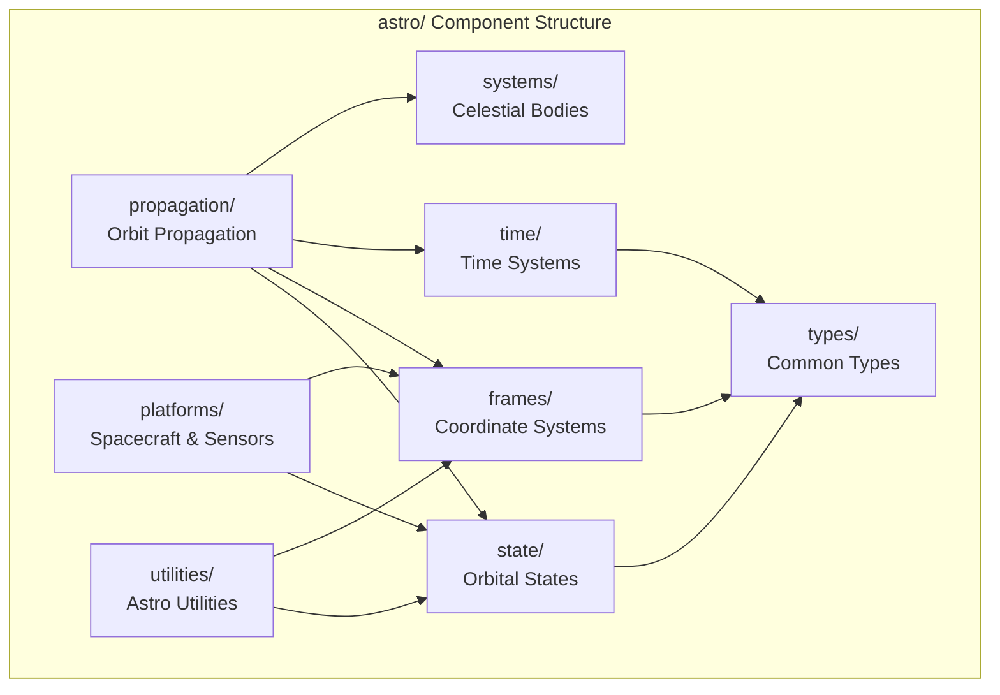
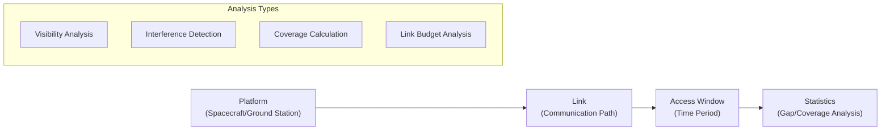
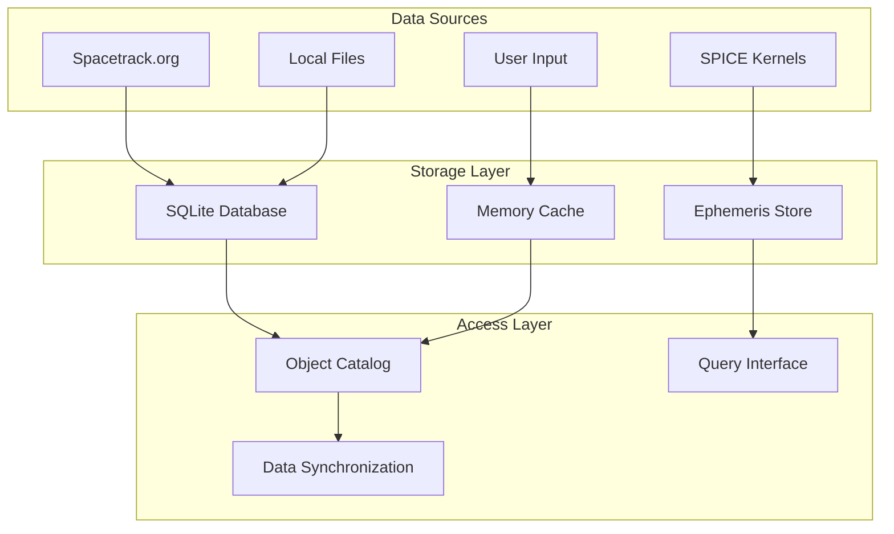
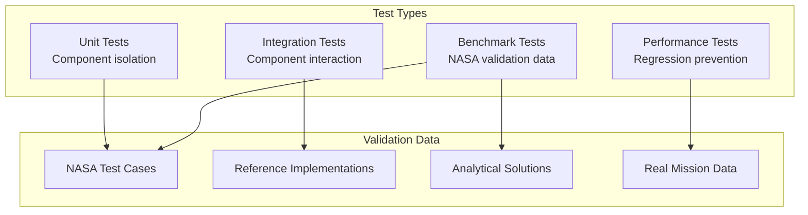

# Architecture

This document provides a detailed view of Astrea's software architecture, component interactions, and design rationale. The architecture reflects the dual goals of safety and performance in aerospace engineering applications.

## High-Level Architecture

### Layered Design

Astrea follows a strict layered architecture where dependencies flow downward and each layer provides a specific level of abstraction:



### Design Constraints

1. **No Circular Dependencies**: Components may only depend on lower layers
2. **Minimal External Dependencies**: Each dependency must provide clear, substantial value
3. **Header-Only Design**: All core functionality available without separate linking
4. **Platform Independence**: No platform-specific code in core libraries
5. **Exception Safety**: All operations provide strong exception safety guarantees

## Component Architecture

### Layer 2: Astrodynamics Core (`astro/`)

The heart of Astrea, providing fundamental astrodynamics functionality:



#### Key Abstractions

| Abstraction | Purpose | Implementation Strategy |
|-------------|---------|------------------------|
| `State` | Represents spacecraft position/velocity | Template-based for different coordinate systems |
| `Frame` | Coordinate reference frames | Type-safe compile-time frame checking |
| `Epoch` | Points in time with time scale info | Immutable value types with automatic conversions |
| `Body` | Celestial bodies with physical properties | Compile-time constants where possible |
| `Propagator` | Advances orbital states through time | Strategy pattern with customizable force models |

#### Data Flow Pattern

1. **Input Validation**: All inputs validated at API boundaries
2. **Unit Conversion**: Automatic unit conversions using mp-units
3. **Frame Transformation**: Explicit coordinate frame handling
4. **Computation**: Core algorithms with error checking
5. **Output Construction**: Results in requested units/frames

### Layer 3: Domain Libraries

#### Access Analysis (`trace/`)



**Key Components**:
- `Platform`: Represents spacecraft, ground stations, or targets
- `Link`: Models communication or observation paths between platforms
- `AccessWindow`: Time intervals when platforms can communicate
- `Interference`: Modeling of signal interference between multiple platforms

#### Data Management (`snapshot/`)



**Key Features**:
- Automatic TLE downloads and updates from Spacetrack.org
- Efficient storage and retrieval of large orbital datasets
- SPICE kernel management and ephemeris caching
- Version control and data provenance tracking

### Layer 1: Foundation Libraries

#### Mathematics (`math/`)

```cpp
```

**Design Principles**:
- All mathematical operations preserve unit information
- Template-based for compile-time optimization
- Immutable value semantics for safety

#### Unit System (`units/`)

```cpp
```

## System Boundaries and Interfaces

### External Integration Points

<!-- 
#### SPICE Integration

```mermaid
sequenceDiagram
    participant App as Application
    participant Astrea as Astrea Core
    participant SPICE as SPICE Toolkit
    participant Kernel as Kernel Files
    
    App->>Astrea: Request planetary ephemeris
    Astrea->>SPICE: Load required kernels
    SPICE->>Kernel: Read ephemeris data
    Kernel->>SPICE: Chebyshev coefficients
    SPICE->>Astrea: Position/velocity vectors
    Astrea->>Astrea: Convert to Astrea types
    Astrea->>App: Unit-aware State object
``` -->


#### Database Integration

```mermaid
erDiagram
    CATALOG {
        string norad_id PK
        string name
        datetime epoch
        string classification
    }
    
    TLE_DATA {
        string norad_id FK
        datetime epoch
        string line1
        string line2
        datetime created
    }
    
    EPHEMERIS {
        string object_id FK
        datetime start_time
        datetime end_time
        blob state_data
        string algorithm
    }
    
    CATALOG ||--o{ TLE_DATA : contains
    CATALOG ||--o{ EPHEMERIS : generates
```

## Error Handling Strategy

### Compile-time Error Prevention

```cpp
// This will not compile - unit mismatch detected at compile-time
auto invalid_calculation() {
    auto distance = 1000.0 * units::metre;
    auto time = 60.0 * units::second;
    auto acceleration = distance + time;  // ERROR: Cannot add length and time
    return acceleration;
}

// This will not compile - frame mismatch detected
auto invalid_transformation() {
    auto state_eci = state::cartesian{/* ... */};
    auto position_ecef = state_eci.position();  // ERROR: Must explicitly convert frames
    return position_ecef;
}
```

<!-- ### Runtime Error Handling

```cpp
// Exception hierarchy for runtime errors
namespace astrea::exceptions {
    class AstreaException : public std::exception {
        // Base class for all Astrea exceptions
    };
    
    class NumericalException : public AstreaException {
        // Numerical integration failures, convergence issues
    };
    
    class DataException : public AstreaException {
        // Missing data, corrupted files, network failures
    };
    
    class ConfigurationException : public AstreaException {
        // Invalid configurations, missing dependencies
    };
}
``` -->

## Performance Architecture

### Compile-time Optimization

```cpp
// Example: Coordinate transformation matrices computed at compile-time
template <typename FromFrame, typename ToFrame>
DCM<FromFrame, ToFrame> get_dcm_impl(const Date& date)
{
    static_assert(!(HasDcm<FromFrame, ToFrame> && HasDcm<ToFrame, FromFrame>), "DCM defined in both directions, please define only one to avoid symmetry issues.");
    static_assert(IsStaticFrame<FromFrame> && IsStaticFrame<ToFrame>, "Dynamic frame conversions cannot be called statically. Dynamic frames must be created at runtime with a platform to reference.");
    static_assert(HasDcm<FromFrame, ToFrame> || HasDcm<ToFrame, FromFrame> || IsSameFrame<FromFrame, ToFrame>, "No DCM defined between these two frames.");

    if constexpr (IsSameFrame<FromFrame, ToFrame>) {
        return DCM<FromFrame, ToFrame>::identity();
    }
    else if constexpr (HasDcm<FromFrame, ToFrame>) {
        return get_dcm<FromFrame, ToFrame>(date);
    }
    else if constexpr (HasDcm<ToFrame, FromFrame>) {
        return get_dcm<ToFrame, FromFrame>(date).transpose();
    }
    throw std::logic_error("How did you get here?");
}
```

<!-- ### Memory Layout Optimization

```cpp
// Structure of Array (SoA) pattern for bulk operations
template<typename T>
class StateArray {
    std::vector<mp_units::quantity<units::metre>> x_, y_, z_;
    std::vector<mp_units::quantity<units::metre_per_second>> vx_, vy_, vz_;
    
public:
    // SIMD-friendly bulk operations
    void propagate_all(mp_units::quantity<units::second> dt);
    void transform_all_to_frame(auto target_frame);
};
``` -->

## Extensibility Architecture

### Plugin Interface Pattern

<!-- ```cpp
// Abstract interface for custom force models
class ForceModel {
public:
    virtual ~ForceModel() = default;
    virtual auto operator()(
        const State& state,
        const Date& epoch
    ) const -> AccelerationVector<frames::earth::icrf> = 0;
    
    virtual auto name() const -> std::string_view = 0;
};
``` -->

### Type Erasure for Runtime Flexibility

<!-- ```cpp
// Type-erased wrapper for different propagator types
class Propagator {
    class PropagatorImpl {
    public:
        virtual ~PropagatorImpl() = default;
        virtual auto propagate(
            const state::cartesian& initial_state,
            mp_units::quantity<units::second> duration
        ) const -> state::cartesian = 0;
    };
    
    template<typename ConcretePropagator>
    class PropagatorWrapper : public PropagatorImpl {
        ConcretePropagator impl_;
    public:
        // Implementation details...
    };
    
    std::unique_ptr<PropagatorImpl> impl_;
};
``` -->

## Quality Assurance Architecture

### Validation Framework



### Continuous Integration Pipeline

1. **Static Analysis**: Code quality, security, and style checks
2. **Unit Testing**: Individual component validation
3. **Integration Testing**: Cross-component interaction testing
4. **Performance Testing**: Benchmark comparison and regression detection
5. **Documentation Testing**: Example code compilation and execution
6. **Platform Testing**: Multi-platform compatibility verification

---

*This architecture represents the evolution of aerospace software engineering practices, combining domain expertise with modern C++ techniques to create a foundation for reliable, high-performance space mission analysis.*