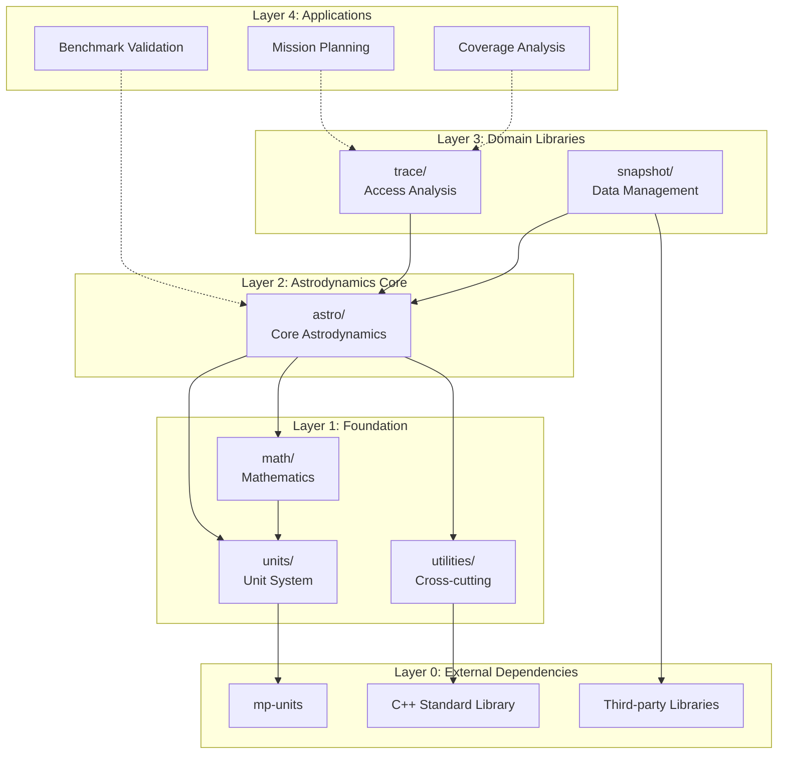
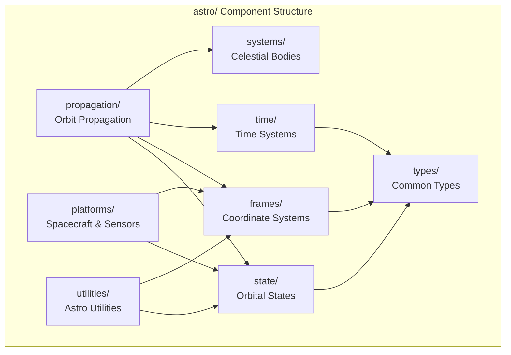
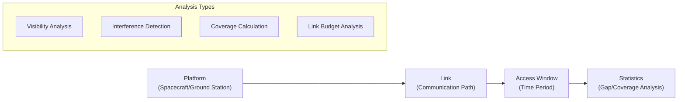
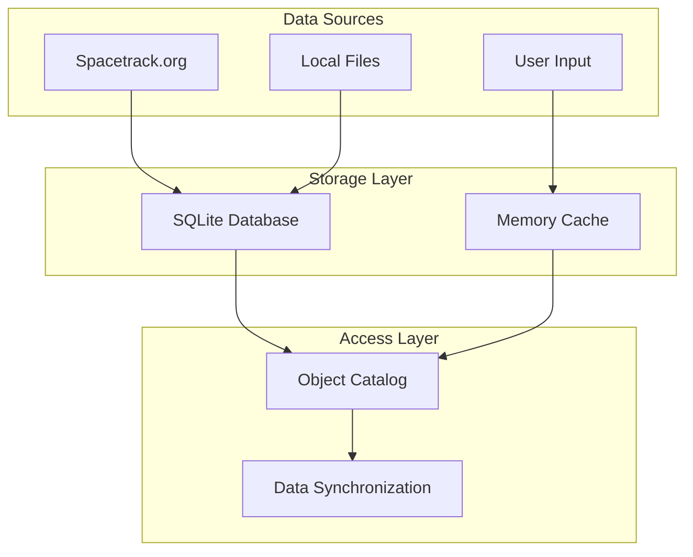
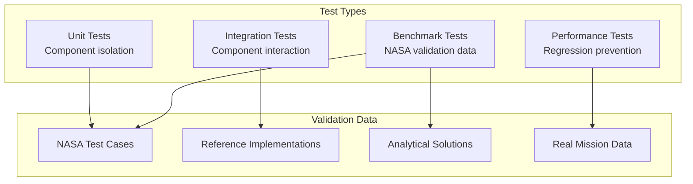

# Architecture

This document provides a detailed view of Astrea's software architecture, component interactions, and design rationale. The architecture reflects the dual goals of safety and performance in aerospace engineering applications.

## High-Level Architecture

Astrea is currently organized as a monolith, with the intention of breaking it out into separate libraries if the scope of any of the individual subprojects grows too large. The core astrodynamics library, `astro` is the bulk of astrea, with `math`, `units`, and `utilities` providing a few simple foundational features. Astrea also has a couple simple tools, `snapshot` for yanking in SpaceTrack data, and `trace`, a simple revisit analysis tool. The latter are meant as examples of building out more complex tooling, they are not meant as production-ready analysis tools. Trace also has developed some nice functionality for ground stations that may be ripped into `astro` in the future.

### Layered Design

Astrea follows a layered architecture where dependencies flow downward and each layer provides a specific level of abstraction:



## Component Architecture

### Layer 1: Foundation Libraries

#### Mathematics (`math/`)

```cpp
```

**Design Principles**:
- All mathematical operations preserve unit information
- Template-based for compile-time optimization
- Immutable value semantics for safety

#### Unit System (`units/`)

```cpp
```

### Layer 2: Astrodynamics Core (`astro/`)

The heart of Astrea, providing fundamental astrodynamics functionality:



### Layer 3: Domain Libraries

#### Access Analysis (`trace/`)



#### Data Management (`snapshot/`)



**Key Features**:
- Automatic TLE downloads and updates from Spacetrack.org
- Efficient storage and retrieval of large orbital datasets

## System Boundaries and Interfaces

### External Integration Points

#### SPICE Integration

SPICE is actually not truly integrated into Astrea. Currently, SPICE Chebyshev polynomials for celestial bodies are stored locally. At compile time, a Python script automatically generates the source files that statically declares those polynomial coefficients. While this can increase the memory required by the tool, it's considerably faster that calling SPICE directly, and it's just as accurate.

There is currently no plan for direct SPICE integration in Astrea.

## Performance Architecture

### Compile-time Optimization

```cpp
// Example: Coordinate transformation matrices computed at compile-time
template <typename FromFrame, typename ToFrame>
DCM<FromFrame, ToFrame> get_dcm_impl(const Date& date)
{
    static_assert(!(HasDcm<FromFrame, ToFrame> && HasDcm<ToFrame, FromFrame>), "DCM defined in both directions, please define only one to avoid symmetry issues.");
    static_assert(IsStaticFrame<FromFrame> && IsStaticFrame<ToFrame>, "Dynamic frame conversions cannot be called statically. Dynamic frames must be created at runtime with a platform to reference.");
    static_assert(HasDcm<FromFrame, ToFrame> || HasDcm<ToFrame, FromFrame> || is_same_frame(FromFrame, ToFrame), "No DCM defined between these two frames.");

    if constexpr (is_same_frame(FromFrame, ToFrame)) {
        return DCM<FromFrame, ToFrame>::identity();
    }
    else if constexpr (HasDcm<FromFrame, ToFrame>) {
        return get_dcm<FromFrame, ToFrame>(date);
    }
    else if constexpr (HasDcm<ToFrame, FromFrame>) {
        return get_dcm<ToFrame, FromFrame>(date).transpose();
    }
    throw std::logic_error("How did you get here?");
}
```

## Quality Assurance Architecture

### Validation Framework



### Continuous Integration Pipeline

1. **Static Analysis**: Code quality, security, and style checks
2. **Unit Testing**: Individual component validation
3. **Integration Testing**: Cross-component interaction testing
4. **Documentation Testing**: Example code compilation and execution

Coming soon:

5. **Performance Testing**: Benchmark comparison and regression detection
6. **Platform Testing**: Multi-platform compatibility verification

---

*This architecture represents the evolution of aerospace software engineering practices, combining domain expertise with modern C++ techniques to create a foundation for reliable, high-performance space mission analysis.*