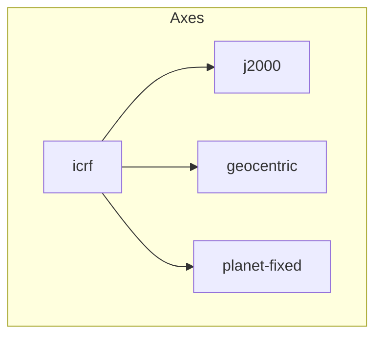
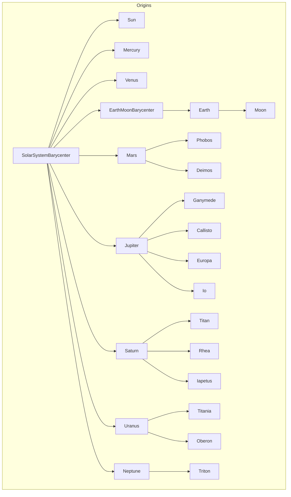

# Frame Transformations

Astrea provides a powerful system for defining and working with coordinate frames. The system is designed to either directly support every frame within the Internation Celestial Reference System (ICRS) or to allow users to easily define their own frames and transformations between them. To facilitate this, frames are composed fundamentally of an `Axis` and an `Origin`. An axis in Astrea is an abstract set of coordinate lines that is not necessarily associated with any particular point in space. In practice, an axis is almost necessarily tied to a specific point, but this higher level of abstraction is useful for generalizing frame transformations. An origin in Astrea represents the physical location that a frame's axes are centered on. Many origins are abstract in nature, representing either the outcome of some set of physical measurements or calculations, but not tied to any concrete physical thing or location. Some are explicitly tied to a physical object but require complex numerical calculations to reference. This frame system captures all these cases and more.

The ICRS is largely focused on the frames associated with astronomy and aerospace applications so many of the associated frames are centered on celestial bodies with well known relational equations for their position and velocity. Since these are well understood, in theory, the only thing required to establish a complete system of frames for all objects in the solar system is a date. Astrea has built out this system in practice. By leveraging SPICE polynomials and output, physical object properties, and a complex type system, Astrea realizes the set of celestial bodies as the defining set of `Origin` objects for frame transformations. By combining these with common definitions for axes, i.e. `icrf` and `j2000`, a wide set of available frames is immediately available. 

```cpp
inline constexpr struct icrf final : Frame<"gcrf", planets::Earth, axes::icrf> {
} icrf;

inline constexpr struct j2000 final : Frame<"eme2000", planets::Earth, axes::j2000> {
} j2000;
```

All that's required to rotate between these frames is a date. 

```cpp
template<>
inline auto get_dcm<icrf, j2000>(const Date& date) -> DCM<icrf, j2000> {
    // math to build this rotation // 
    return dcm;
}
```

which results in a simple interface for users to get the transformation between these frames at any given date.

```cpp
Date date("2024-01-01T00:00:00Z");
DCM<icrf, j2000> dcmIcrfToJ2000 = get_dcm<icrf, j2000>(date);
```

Astrea takes this further by strapping the frame system to its state vector and kinematics systems. This allows users to easily transform between frames without needing to worry about the underlying details of how the transformations are defined. For example, if a user has a state vector defined in the `icrf` frame and wants to transform it to the `j2000` frame, they can simply do:

```cpp
RadiusVector<icrf> rIcrf = {...};
// Manually rotating the vector using the DCM
RadiusVector<j2000> rJ2000 = dcmIcrfToJ2000 * rIcrf;
// Using the frame transformation system to automatically rotate the vector
auto rJ2000 = rIcrf.in_frame<j2000>(date);
```

The transformation capability also automatically translates between frames with different origins. For example, if a user has a state vector defined around the Earth and wants to transform it to a frame centered on the Sun, they utilize the same syntax as before:

```cpp
RadiusVector<frames::earth::icrf> rEarth = {...};
auto rSun = rEarth.in_frame<frames::sun::icrf>(date);
```

*Note: The `Date` object is compile-time constructable via Julian dates. If a user invokes the transformations using these compile-time Dates, the entire frame transformation system will operate at compile time as well.*

## Hierarchy of Frames
Astrea's frame system is hierarchical in nature. By defining origin's and axes with parentage, an implicit type-tree can be used to chain any number of frames together arbitrarily. Astrea's `Origin` and `Axis` each have an optional "parent" declaration. This parent is used to signify which transformations are already defined by the system and allow the machinery to recusrively dig for the necessary path to get from one frame to another. For example, the `j2000` frame is defined as a child of the `icrf` frame. Though this is meaningless physically, it allows the frame system to know that any frame with the `j2000` axis can be transformed to any frame with the `icrf` axis, and vice versa, without needing to define a direct transformation between them. This allows for a much more flexible and extensible system of frames, as users can define their own frames and transformations without needing to worry about how they fit into the overall system. 

The axes have a releatively simple construction, with the `icrf` being the "default" frame of the entire transformation system. All axes are currently defined as children of the `icrf` axis. 


What this means in practice is not that any particular frame is necessarily defined as a derivative of the `icrf`, but that any axes transformation must first go through the `icrf` as a common ancestor. For example, going from `ecef` to `j2000` would first go from `ecef` to `icrf`, then from `icrf` to `j2000` unless an explicit direct transformation is defined between `ecef` and `j2000`.

The origins work in a similar way, but the system is more complex. In general, Astrea tries to follow SPICE conventions for parentage of celestial bodies. This means that the Earth is a child of the Earth-Moon barycenter, and the Moon is a child of the Earth, but no other planet is defined in such a way. Automatic origin translation requires physical location data and it is much easier to lean into the outputs of SPICE than trying to dictate a hierarchy that conflicts with it. The consequence is that translating from Earth to Sun positions, for example, requires two translations instead of one, but generally this isn't much of an issue. 



All frame transformations in Astrea will implicitly follow this tree, chaining translations and rotations to work from one axis/origin pair to another, completing the frame transformation system.

## Custom Frames
Custom frames can be defined by simply defining new frame types, and then defining a DCM to other established frames. A single DCM should be sufficient to connect a new frame to the entire network of Astrea frames.

```cpp
inline constexpr struct my_axes final : Axis<"MyAxis", axes::icrf> {
} my_axes;

inline constexpr struct my_earth_frame final : Frame<"my_earth_frame", planets::Earth, my_axes> {
} my_earth_frame;
```

And then the DCM specialization to connect it to the rest of the system:
```cpp
namespace astrea {
namespace astro {

template <>
inline constexpr DCM<my_earth_frame, gcrf> get_dcm(const Date& date)
{
    return DCM<my_earth_frame, gcrf>::identity(); // Or whatever the DCM would be
}

} namespace astro
} namespace astrea
```

Custom origins can be defined similarly, but have more restrictions to work properly.
A simple frame with nothing but a name is considered a complete definition, but it won't be able to connect to any of the other defined frames unless it defines a parent origin within the current graph of origins.

```cpp
inline constexpr struct my_origin final : Origin<"MyOrigin"> {
} my_origin;
inline constexpr struct my_frame final : Frame<"my_frame", my_origin, my_axes> {
} my_frame;
```

If we want this frame to use the same rotation as the previous one, we can just add some requires clauses to the DCM definition to allow it to be used if the frames share the same axis.
```cpp
namespace astrea {
namespace astro {

// Note: equivalence is recommended over direct equality, but both are supported
template <IsFrame auto in_frame, IsFrame auto out_frame>
    requires(equivalent(in_frame.axis, my_axes) && equivalent(out_frame.axis, axes::icrf)) 
inline constexpr DCM<in_frame, out_frame> get_dcm(const Date& date)
{
    return DCM<in_frame, out_frame>::identity();
}

} namespace astro
} namespace astrea
```

If we want the origin to hook into the system of origins, we need to define a parent origin that is already in the system. This will allow us to compute the position and velocity of the origin automatically, which is necessary for frame transformations.

*Note: It is required to use a CelestialBody or a Barycenter as the origin base type to properly hook into the system. This may be changed in future releases to be more flexible.*

```cpp
inline constexpr struct my_origin_with_parent final : CelestialBody<"MyOriginWithParent", planets::Earth> {
} my_origin_with_parent;

inline constexpr struct my_complete_frame final : Frame<"my_complete_frame", my_origin_with_parent, my_axes> {
} my_complete_frame;
```

The frame system still needs a way to locate your origin in space so if you want add a dynamically translating origin, you can either make your origin a celestial reference object (a planet, asteroid, barycenter, etc.) or you have to use a DynamicFrame, which must be evaluated at runtime and cannot be used in compile-time contexts.

Adding your origin to the origin system requires that you define a single function specialization that returns
all the celestial body parameters or specializing the get position/velocity functions for your origin.

_Option 1_: This will use orbital elements to determine the origin's position and velocity.
```cpp
namespace astrea {
namespace astro {

template <>
inline constexpr CelestialBodyParameters get_celestial_body_parameters<my_origin_with_parent>()
{
    // Return the celestial body parameters for my_origin_with_parent.
    return CelestialBodyParameters{
        ...
    };
}

} // namespace astro
} // namespace astrea
```

_Option 2_: This gives you more control over the position and velocity, but requires more complexity.
```cpp
namespace astrea {
namespace astro {

template <>
inline constexpr RadiusVector<get_parent_frame(my_origin_with_parent, axes::icrf)>
    get_position_at<my_origin_with_parent>(const Date& date)
{
    // Return the position of my_origin_with_parent with respect to the origin's parent at the given date.
    // Note that the position must be returned in the frame defined by the origin's parent but the axes are
    // arbitrary. To avoid unnecessary rotations, it's required to return the position w.r.t. the icrf axes.

    // You can use the helper function to define the expected frame generically
    static constexpr auto parent_frame = get_parent_frame(my_origin_with_parent, axes::icrf);

    // This is just an example, so we'll return a constant dummy position.
    return RadiusVector<parent_frame>{ 149597870.7 * km, 0.0 * km, 0.0 * km };
}

template <>
inline constexpr VelocityVector<get_parent_frame(my_origin_with_parent, axes::icrf)>
    get_velocity_at<my_origin_with_parent>(const Date& date)
{
    static constexpr auto parent_frame = get_parent_frame(my_origin_with_parent, axes::icrf);
    return VelocityVector<parent_frame>{ 0.0 * km / s, 29.78 * km / s, 0.0 * km / s };
}

} // namespace astro
} // namespace astrea
```

*Note: You can define both of these functions if you want to use your origin as a celestial body anywhere in the code. The explicit get_position_at and get_velocity_at specializations will take priority when computing the position and velocity but the first option is required to, for example, use your origin for n-body calculations.*

Now with everything defined, your frame is fully connected to the system of frames and you can use it in any
frame transformation or vector operation that you'd like!
```cpp
const auto rMyFrame   = CartesianVector<Length, my_complete_frame>{ 1.0 * km, 2.0 * km, 3.0 * km };
const auto rGCRF      = rMyFrame.in_frame<gcrf>(J2000);
const auto rEME2000   = rMyFrame.in_frame<eme2000>(J2000);
const auto rMarsFixed = rMyFrame.in_frame<frames::mars::mars_fixed>(J2000);
```