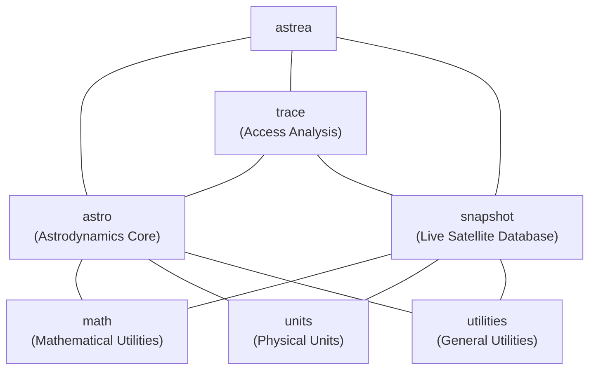

# Project structure

This chapter provides a high level overview of the Astrea project to make it easier to navigate, build, and use.

Astrea was designed as a monorepo with a single CMake project to simplify development and ensure that all components are built and tested together. The project is organized into several core libraries and components, each with its own directory and CMake target.

Currently, there are 3 main libraries:
- `astrea::astro` - the core astrodynamics library with frames, propagation, time systems, and celestial mechanics
- `astrea::trace` - the access analysis library for calculating access times, gaps, and interference between platforms
- `astrea::snapshot` - the live satellite database with Spacetrack.org integration for real-time orbital data
The other libraries (`astrea::math`, `astrea::units`, and `astrea::utilities`) provide supporting functionality used across the project.

Future versions of Astrea may reorganize some of these for clarity and uniformity, and new libraries may be added as the project evolves. 

There is not currently a single `astrea::astrea` target, or similar, but as user needs become more apparent, this may change.

## CMake projects and dependencies

The [GitHub repository](https://github.com/iulianojay/astrea) contains the main
CMake-based project with several core components:

- **_./astrea_**
    - general umbrella for all the various smaller libraries and components that make up the core of the project
    - constains all various components and high level requirements and dependencies
    - dependencies include:
        - [mp-units](https://github.com/mpusz/mp-units) for compile-time dimensional analysis
          and unit safety
        - [sqlite-orm](https://github.com/fnc12/sqlite_orm) for orbital database management
        - [libcpr](https://github.com/libcpr/cpr) for HTTP requests (Spacetrack.org integration)
        - [nlohmann-json](https://github.com/nlohmann/json) for JSON parsing and serialization
        - [date](https://github.com/HowardHinnant/date) for time and calendar utilities
        - [csv-parser](https://github.com/vincentlaucsb/csv-parser) for data file processing
        - [parallel_hashmap](https://github.com/greg7mdp/parallel-hashmap) for high-performance containers
        - [GoogleTest](https://github.com/google/googletest) library as a unit tests framework
        - [Google Benchmark](https://github.com/google/benchmark) for performance testing

- **_./astrea/astro_**
    - Core astrodynamics library with frames, propagation, time systems, and celestial mechanics
    - Provides the fundamental tools for orbital mechanics, spacecraft analysis, and mission planning

- **_./astrea/snapshot_**
    - Live satellite database with Spacetrack.org integration for real-time orbital data
    - Provides tools for querying, storing, and analyzing satellite catalog data

- **_./astrea/trace_**
    - Access analysis library for calculating access times, gaps, and interference between platforms
    - Integrates with the core astrodynamics library for accurate geometry and time handling
    - Serves as an example of how to use and extend Astrea for specific aerospace applications

- **_./astrea/math_**
    - Mathematical utilities optimized for astrodynamics applications
    - Provides unit-aware mathematical functions, vector/matrix operations, and numerical algorithms

- **_./astrea/units_**
    - Extensions to mp-units for aerospace-specific quantities and common unit definitions

- **_./astrea/utilities_**
    - General purpose utilities and algorithms used across the project

- **_./scripts_**
    - Build automation, coverage reporting, and development utility scripts

!!! important "Important: Library users should tailor their includes and dependencies to their needs"

    The project is organized into multiple libraries to allow users to include only the components they need. 
    For example, if you only need the core astrodynamics functionality, you can link against `astrea::astro` without pulling in the access analysis or satellite database components. This helps keep compile times and binary sizes down for users who don't need the full functionality of the project

## Core Components

The **Astrea** library provides the following major components:

| Component    | CMake Target      | Contents                                                     |
|--------------|-------------------|--------------------------------------------------------------|
| `astro`      | `astrea::astro`   | Core astrodynamics: frames, propagation, time, orbital states|
| `math`       | `astrea::math`    | Mathematical utilities                                       |
| `units`      | `astrea::units`   | Unit definitions and simple utilities                        |
| `utilities`  | `astrea::utilities`   | General purpose utilities and algorithms                     |
| `trace`      | `astrea::trace`   | Access analysis: calculation of access, gap, and interference times with statistics |
| `snapshot`   | `astrea::snapshot`| Spacetrack integrated databasing for real-time orbital data  |

## Header files

All of the project's header files can be found in the `astrea/...` subdirectory.

### Core astrodynamics library (`astrea/astro/`)

- `astrea/astro/astro.hpp` contains the entire astrodynamics framework,
- `astrea/astro/astro.fwd.hpp` provides forward declarations for faster compilation,
- `astrea/astro/astro.macros.hpp` contains utility macros for the library,

#### Frames and coordinate systems

- `astrea/astro/frames/...` provides coordinate frame definitions and transformations:
    - Fixed frames (ICRF, ITRF, etc.)
    - Dynamic frames (True of Date, Mean of Date, etc.)
    - Topocentric frames (SEZ, NED, etc.)
    - Custom user-defined frames

#### Orbital mechanics

- `astrea/astro/state/...` provides orbital state representations:
    - Cartesian position and velocity
    - Classical orbital elements (Keplerian)
    - Equinoctial elements
    - Modified equinoctial elements
    - Delaunay elements
-  `astrea/astro/propagation/...` provides propagation algorithms:
    - Analytical propagators (Kepler, J2, etc.)
    - Numerical integrators (RK4, RK45, etc.)
    - Force model framework
    - Event detection during propagation

#### Celestial mechanics

- `astrea/astro/systems/...` provides celestial body definitions:
    - Solar system planets and moons
    - Gravitational parameters
    - Physical and orbital characteristics
    - SPICE integration for ephemerides

#### Time systems

- `astrea/astro/time/...` provides time system utilities:
    - Julian Date conversions
    - UTC, TT, TAI, GPS time
    - Time scale transformations
    - Leap second handling

#### Platform and mission analysis

- `astrea/astro/platforms/...` provides spacecraft and mission modeling:
    - Spacecraft definitions with mass, area, and other properties
    - Access analysis and coverage calculations
    - Link budget and communication analysis
    - Attitude representations and kinematics

### Supporting libraries

#### Mathematical utilities (`astrea/math/`)

- Unit-aware mathematical functions optimized for astrodynamics
- Vector and matrix operations with compile-time dimension checking
- Numerical analysis algorithms (root finding, interpolation, etc.)
- Statistics and filtering utilities for orbital determination

#### Units integration (`astrea/units/`)

- Extensions to mp-units for aerospace-specific quantities
- Custom unit definitions for astrodynamics (Earth radii, gravitational parameters, etc.)
- Unit-aware I/O and serialization
- Integration with legacy astrodynamics unit conventions

#### General utilities (`astrea/utilities/`)

- Data structure utilities and containers
- String processing and formatting for aerospace data
- File I/O utilities for common astrodynamics file formats
- Configuration and settings management

#### Access analysis (`astrea/trace/`)

- Access time calculation between spacecraft, ground stations, and targets
- Gap analysis for communication windows and coverage periods
- Interference detection and modeling for multi-platform scenarios
- Statistical analysis of access patterns and coverage metrics
- Link budget integration with access calculations
- Revisit time analysis for Earth observation missions
- Coverage area analysis and visualization tools
- Real-time access prediction and event scheduling

#### Data persistence (`astrea/snapshot/`)

- Serialization for orbital states and spacecraft data
- Binary and text format support
- Version-compatible data persistence
- Efficient storage for large datasets

??? tip "Tip: Improving compile times"

    `astrea/astro/astro.hpp` might be expensive to compile in every translation unit. Consider
    including only the specific headers you need from the `astrea/astro/...` subdirectories
    for faster compilation.
