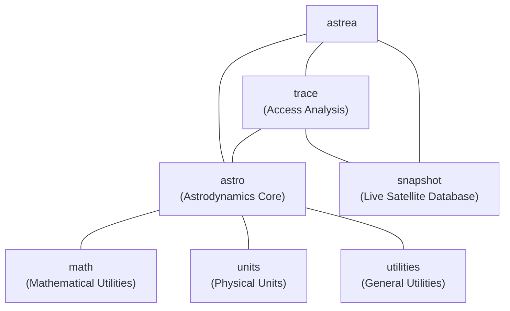

# Project structure

This chapter provides a high level overview of the Astrea project to make it easier to navigate, build, and use.

## CMake projects and dependencies

The [GitHub repository](https://github.com/iulianojay/astrea) contains the main
CMake-based project with several core components:

- **_./astrea_**

    - header-only project containing the whole **Astrea** astrodynamics library
    - _./astrea/CMakeLists.txt_ file is the **entry point for library users**
    - depends on the following external libraries:

        - [mp-units](https://github.com/mpusz/mp-units) for compile-time dimensional analysis
          and unit safety
        - [sqlite-orm](https://github.com/fnc12/sqlite_orm) for orbital database management
        - [libcpr](https://github.com/libcpr/cpr) for HTTP requests (Spacetrack.org integration)
        - [nlohmann-json](https://github.com/nlohmann/json) for JSON parsing and serialization
        - [date](https://github.com/HowardHinnant/date) for time and calendar utilities
        - [csv-parser](https://github.com/vincentlaucsb/csv-parser) for data file processing
        - [parallel_hashmap](https://github.com/greg7mdp/parallel-hashmap) for high-performance containers

- **_._**

    - project used as an **entry point for library development and CI/CD**
    - it wraps _./astrea_ project together with usage examples and tests
    - additionally to the dependencies of _./astrea_ project, it uses:

        - [GoogleTest](https://github.com/google/googletest) library as a unit tests framework
        - [Google Benchmark](https://github.com/google/benchmark) for performance testing

- **_./scripts_**

    - Build automation, coverage reporting, and development utility scripts

!!! important "Important: Library users should use the astrea/ directory as entry point"

    Top level _CMakeLists.txt_ file should primarily be used by **Astrea** developers and
    contributors as an entry point for the project's development. We want to ensure that
    everyone will build **ALL** the code correctly before pushing a commit.

    This is why our project has two main entry points:

    - _./CMakeLists.txt_ is **to be used by project developers** to build **ALL** the project
      code with restrictive compilation flags and comprehensive testing,
    - _./astrea/CMakeLists.txt_ contains the pure library definition and **should be used by
      customers** that prefer to use CMake's
      [`add_subdirectory()`](https://cmake.org/cmake/help/latest/command/add_subdirectory.html)
      to handle the dependencies.

## Core Components

The **Astrea** library provides the following major components:

| Component    | CMake Target      | Contents                                                     |
|--------------|-------------------|--------------------------------------------------------------|
| `astro`      | `astrea::astro`   | Core astrodynamics: frames, propagation, time, orbital states|
| `math`       | `astrea::math`    | Mathematical utilities                                       |
| `units`      | `astrea::units`   | Unit definitions and simple utilities                        |
| `utilities`  | `astrea::utils`   | General purpose utilities and algorithms                     |
| `trace`      | `astrea::trace`   | Access analysis: calculation of access, gap, and interference times with statistics |
| `snapshot`   | `astrea::snapshot`| Spacetrack integrated databasing for real-time orbital data  |

## Header files

All of the project's header files can be found in the `astrea/...` subdirectory.

### Core astrodynamics library (`astrea/astro/`)

- `astrea/astro/astro.hpp` contains the entire astrodynamics framework,
- `astrea/astro/astro.fwd.hpp` provides forward declarations for faster compilation,
- `astrea/astro/astro.macros.hpp` contains utility macros for the library,

#### Frames and coordinate systems

- `astrea/astro/frames/...` provides coordinate frame definitions and transformations:
    - Fixed frames (ICRF, ITRF, etc.)
    - Dynamic frames (True of Date, Mean of Date, etc.)
    - Topocentric frames (SEZ, NED, etc.)
    - Custom user-defined frames

#### Orbital mechanics

- `astrea/astro/state/...` provides orbital state representations:
    - Cartesian position and velocity
    - Classical orbital elements (Keplerian)
    - Equinoctial elements
    - Modified equinoctial elements
    - Delaunay elements
-  `astrea/astro/propagation/...` provides propagation algorithms:
    - Analytical propagators (Kepler, J2, etc.)
    - Numerical integrators (RK4, RK45, etc.)
    - Force model framework
    - Event detection during propagation

#### Celestial mechanics

- `astrea/astro/systems/...` provides celestial body definitions:
    - Solar system planets and moons
    - Gravitational parameters
    - Physical and orbital characteristics
    - SPICE integration for ephemerides

#### Time systems

- `astrea/astro/time/...` provides time system utilities:
    - Julian Date conversions
    - UTC, TT, TAI, GPS time
    - Time scale transformations
    - Leap second handling

#### Platform and mission analysis

- `astrea/astro/platforms/...` provides spacecraft and mission modeling:
    - Spacecraft definitions with mass, area, and other properties
    - Access analysis and coverage calculations
    - Link budget and communication analysis
    - Attitude representations and kinematics

### Supporting libraries

#### Mathematical utilities (`astrea/math/`)

- Unit-aware mathematical functions optimized for astrodynamics
- Vector and matrix operations with compile-time dimension checking
- Numerical analysis algorithms (root finding, interpolation, etc.)
- Statistics and filtering utilities for orbital determination

#### Units integration (`astrea/units/`)

- Extensions to mp-units for aerospace-specific quantities
- Custom unit definitions for astrodynamics (Earth radii, gravitational parameters, etc.)
- Unit-aware I/O and serialization
- Integration with legacy astrodynamics unit conventions

#### General utilities (`astrea/utilities/`)

- Data structure utilities and containers
- String processing and formatting for aerospace data
- File I/O utilities for common astrodynamics file formats
- Configuration and settings management

#### Access analysis (`astrea/trace/`)

- Access time calculation between spacecraft, ground stations, and targets
- Gap analysis for communication windows and coverage periods
- Interference detection and modeling for multi-platform scenarios
- Statistical analysis of access patterns and coverage metrics
- Link budget integration with access calculations
- Revisit time analysis for Earth observation missions
- Coverage area analysis and visualization tools
- Real-time access prediction and event scheduling

#### Data persistence (`astrea/snapshot/`)

- Serialization for orbital states and spacecraft data
- Binary and text format support
- Version-compatible data persistence
- Efficient storage for large datasets

??? tip "Tip: Improving compile times"

    `astrea/astro/astro.hpp` might be expensive to compile in every translation unit. Consider
    including only the specific headers you need from the `astrea/astro/...` subdirectories
    for faster compilation.
